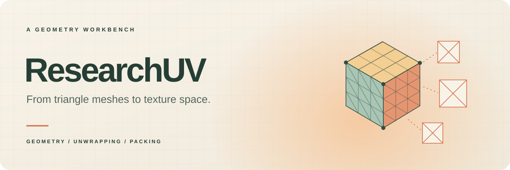
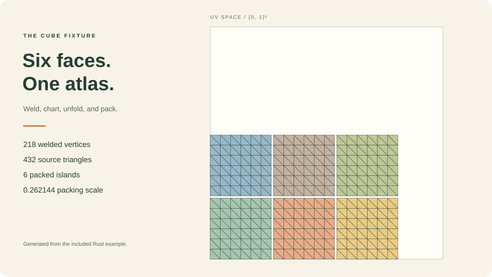
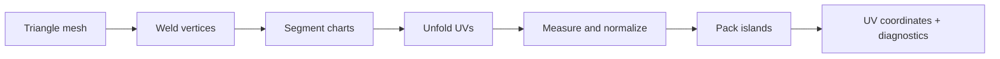

<a id="readme-top"></a>

<div align="center">



# ResearchUV

**Explore the path from triangle meshes to texture space.**

An experimental Rust workspace for mesh processing, UV unwrapping, and island packing.
Build on the individual crates or run the complete unfolding pipeline.

[Quick start](#quick-start) · [Features](#features) · [Workspace](#workspace) · [Development](#development) · [Roadmap](#roadmap)


[](LICENSE)


<sub>Nine crates · inspectable algorithms · reproducible mesh fixtures</sub>

</div>

> [!IMPORTANT]
> **Experimental software.** ResearchUV is an active research prototype. APIs and numerical behavior may change; validate your meshes and UV output before using them in a production workflow.

<br>

<details>
<summary><kbd>Table of contents</kbd></summary>

- [👋 Quick start](#quick-start)
- [✨ Features](#features)
- [🧭 Pipeline](#pipeline)
- [📦 Workspace](#workspace)
- [⌨️ Development](#development)
- [🗺️ Roadmap](#roadmap)
- [🤝 Contributing](#contributing)
- [📄 Licensing](#licensing)

</details>

<a id="quick-start"></a>

## 👋 Quick start

Use a current stable Rust toolchain with Cargo.

```sh
git clone https://github.com/ahnafnafee/researchuv.git
cd researchuv
cargo test --workspace --locked --release
cargo run --locked --release -p researchuv-unwrap --example unwrap_cube -- cube-uv.svg
```

The example creates a subdivided cube, runs the unfolding pipeline, and writes its packed UV triangles to `cube-uv.svg`. Open the SVG in a browser to inspect the six islands.



<div align="center">
<sub>Actual output from the included cube example. Colors identify islands; lines show the triangle mesh.</sub>
</div>

### Open the editor

A browser-served atlas editor runs the whole pipeline live:

```sh
cargo run --locked --release -p researchuv-editor -- --open
```

Pick a fixture, tune the cut angle, packer, seam cuts, distortion-driven re-cutting, thread count, and the CUDA solve; every run repaints the packed islands with per-chart distortion metrics.

### Use the command line

The `researchuv` CLI unwraps OBJ/STL files or built-in fixtures and writes the packed atlas back out:

```sh
cargo run --locked --release -p researchuv-cli -- unwrap --fixture cube 6 --svg cube-atlas.svg
cargo run --locked --release -p researchuv-cli -- unwrap model.obj -o model-uv.obj
cargo run --locked --release -p researchuv-cli -- info model.stl
```

`unwrap` prints a per-chart distortion table, uses the island packer by default (`--packer shelf` restores the reference packer), can seam-cut closed surfaces (`--seam-cut`), and exits non-zero when validation finds errors.

### Use the library

The same pipeline accepts vertex positions and triangle indices from your own mesh loader. This minimal example uses a built-in fixture:

```rust
use researchuv_unwrap::{meshgen, run, PipelineOptions};

let (positions, triangles) = meshgen::cube(6);
let result = run(positions, triangles, &PipelineOptions::default())
    .expect("the input was validated");

assert_eq!(result.charts.len(), 6);
assert!(result.placed.iter().all(Option::is_some));
assert!(!result.atlas_report.has_errors());

for island in &result.multi.islands {
    println!("{} vertices, {} triangles", island.uv.len(), island.tris.len());
}
```

Add `researchuv-unwrap` as a path dependency when integrating it into another local project:

```toml
[dependencies]
researchuv-unwrap = { path = "../researchuv/crates/researchuv-unwrap" }
```

> [!NOTE]
> Everything is available from the Rust API: CLI, editor, I/O, API catalog, host integration, multi-core and CUDA execution.

<a id="features"></a>

## ✨ Features

### Geometry with inspectable topology

Construct half-edge surfaces from triangles, traverse face adjacency, and keep source vertex indices alongside UV islands. The core crate also provides typed parameter values, a binary codec, configurable tasks, and island snapshots for undo and redo.

### A complete unfolding path

Weld coincident vertices, split the mesh into charts at sharp edges (optional geodesic seam trees for closed surfaces and distortion-driven re-cutting for charts that fold), and solve for UV coordinates with a least-squares conformal mapping (LSCM) driver — on the CPU's direct sparse LU, on worker threads, or on the GPU. Per-chart diagnostics report angular distortion, area ratios, flipped triangles, and winding folds before the results are normalized and packed.

### Packing as a separate building block — now wired in

The unfolding pipeline offers two final packers: the historic greedy shelf packer (the reference `CFinalPack` behavior recorded by the regression baselines) and the separate `researchuv-pack` engine — a CPU clone of UVPackmaster 4.1.2's island packer with rotations, flips, margins (relative or pixel), scale modes, target boxes, tiling, grouping, similarity stacking, texel density, pixel-perfect alignment, a time-budgeted heuristic search, and polygon-level overlap validation on island outlines *with holes*. Select it with `PipelineOptions.packer = Packer::Islands` (the CLI uses it by default).

| Area | Available building blocks |
| --- | --- |
| **Mesh preparation** | Vertex welding, degenerate-face filtering, adjacency, and boundary loops |
| **Unwrapping** | Sharp-edge charting, geodesic seam trees for closed charts, least-squares solving, border constraints, and chart normalization |
| **Packing** | Shelf packing or the configurable UVPackmaster-grade island packer, connected to the pipeline |
| **Diagnostics** | Conformal and area distortion, winding-consistency folds, overlap checks, and topology invariants |
| **Validation** | Malformed-mesh reports (indices, NaNs, non-manifold edges, isolated vertices) and atlas reports (unplaced islands, UVs outside `[0,1]²`, overlaps) |
| **Fixtures** | Subdivided cubes, UV spheres, closed tori, torus annuli, grid planes, and open cylinders |
| **Execution** | Deterministic multi-core unfold stage, plus a CUDA conjugate-gradient solver (120×+ on large charts, CPU fallback) |
| **I/O & tooling** | OBJ/STL import, OBJ/STL/SVG export, the `researchuv` CLI, a catalog API with host dispatch, a browser atlas editor, and stage benchmarks |

<div align="right">

[Back to top ↑](#readme-top)

</div>

<a id="pipeline"></a>

## 🧭 Pipeline



`PipelineOptions` exposes welding tolerance, the sharp-edge angle, the seam-cut policy, unfolding settings, packer selection (`Shelf` or `Islands` with the full `PackParams` surface), padding, and retry limits. `PipelineResult` returns the welded mesh, chart results with distortion metrics, placement status, scale, final islands, the island packer's full result contract, and validation reports — so callers can inspect intermediate results as well as the packed output.

> [!IMPORTANT]
> Inspect placement status, distortion, and the validation reports before using an atlas. Strongly curved charts can fold under the rectangle-pinned least-squares solve; the validator reports winding-inconsistent triangles and the `--recut` / `SplitCut` option re-cuts folding charts automatically.

<a id="workspace"></a>

## 📦 Workspace

| Crate | Role | Status |
| --- | --- | --- |
| [`researchuv-math`](crates/researchuv-math) | Vectors, matrices, geometry factors, and bounding boxes | Implemented |
| [`researchuv-core`](crates/researchuv-core) | Mesh topology, values, tasks, configuration, undo/redo, and OBJ/STL/SVG I/O | Implemented |
| [`researchuv-unwrap`](crates/researchuv-unwrap) | End-to-end unfolding, seam cutting, validation, and packing | Implemented |
| [`researchuv-pack`](crates/researchuv-pack) | UVPackmaster-4.1.2-grade CPU island packing | Implemented |
| [`researchuv-api`](crates/researchuv-api) | Structured API catalog | Implemented |
| [`researchuv-link`](crates/researchuv-link) | Host integration (catalog dispatch + wire framing) | Implemented |
| [`researchuv-cli`](crates/researchuv-cli) | Command-line entry point | Implemented |
| [`researchuv-gpu`](crates/researchuv-gpu) | CUDA conjugate-gradient solver (runtime-loaded driver API) | Implemented |
| [`researchuv-editor`](crates/researchuv-editor) | Browser-served atlas editor | Implemented |

The current dependency graph contains only workspace crates. Numerical kernels and geometry utilities use the Rust standard library.

<a id="development"></a>

## ⌨️ Development

```sh
# Build and run the unit and integration suites.
cargo test --workspace --locked --release

# Exercise the mesh pipeline regression fixtures.
cargo test --locked --release -p researchuv-unwrap --test parity

# Time the pipeline stages over the fixture set (incl. large grids/cylinders
# and a CUDA-solve column when a device is present).
cargo bench --locked -p researchuv-unwrap

# Generate local API documentation.
cargo doc --workspace --no-deps --open
```

Release-mode tests make the larger sphere and torus fixtures practical to run. The suite checks numerical primitives, topology, serialization, task behavior, packing constraints, I/O round-trips, the CLI end to end, and the four original mesh fixtures. These tests establish regression behavior for the included cases; they are not a benchmark of arbitrary production meshes.

<a id="roadmap"></a>

## 🗺️ Roadmap

- [x] Connect the configurable island packer to the unfolding pipeline.
- [x] Add mesh import/export and a working CLI.
- [x] Implement the API catalog and host integration layer.
- [x] Improve seam selection and distortion on closed surfaces.
- [x] Expand validation for malformed meshes and unsuccessful packing.
- [x] Add performance benchmarks and larger mesh fixtures.
- [x] GPU execution (CUDA conjugate-gradient unfold solve) and an interactive atlas editor (browser-served).
- [x] Distortion-driven chart splitting (folding charts re-cut automatically).
- [ ] Preconditioned GPU solver (Jacobi/IC0) and GPU packing heuristics.

<a id="contributing"></a>

## 🤝 Contributing

Keep changes focused and include a small reproducible mesh when reporting a geometry problem. For solver and packing changes, describe the expected result, relevant tolerances, and any effect on determinism. Run the workspace tests before opening a pull request, and use Conventional Commits for commit subjects and PR titles.

<a id="licensing"></a>

## 📄 Licensing

Licensed under the [Apache License 2.0](LICENSE).

<div align="right">

[Back to top ↑](#readme-top)

</div>
