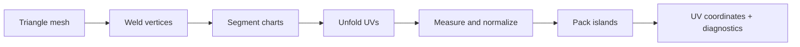

<a id="readme-top"></a>

<div align="center">


# ResearchUV

**Explore the path from triangle meshes to texture space.**

An experimental Rust workspace for mesh processing, UV unwrapping, and island packing.
Build on the individual crates or run the complete unfolding pipeline.

[Quick start](#quick-start) · [Features](#features) · [Workspace](#workspace) · [Development](#development) · [Roadmap](#roadmap)


[](LICENSE)


<sub>Seven crates · inspectable algorithms · reproducible mesh fixtures</sub>

</div>

> [!IMPORTANT]
> **Experimental software.** ResearchUV is an active research prototype. APIs and numerical behavior may change; validate your meshes and UV output before using them in a production workflow.

<br>

<details>
<summary><kbd>Table of contents</kbd></summary>

- [👋 Quick start](#quick-start)
- [✨ Features](#features)
- [🧭 Pipeline](#pipeline)
- [📦 Workspace](#workspace)
- [⌨️ Development](#development)
- [🗺️ Roadmap](#roadmap)
- [🤝 Contributing](#contributing)
- [📄 Licensing](#licensing)

</details>

<a id="quick-start"></a>

## 👋 Quick start

Use a current stable Rust toolchain with Cargo.

```sh
git clone https://github.com/ahnafnafee/researchuv.git
cd researchuv
cargo test --workspace --locked --release
cargo run --locked --release -p researchuv-unwrap --example unwrap_cube -- cube-uv.svg
```

The example creates a subdivided cube, runs the unfolding pipeline, and writes its packed UV triangles to `cube-uv.svg`. Open the SVG in a browser to inspect the six islands.


<div align="center">
<sub>Actual output from the included cube example. Colors identify islands; lines show the triangle mesh.</sub>
</div>

### Use the library

The same pipeline accepts vertex positions and triangle indices from your own mesh loader. This minimal example uses a built-in fixture:

```rust
use researchuv_unwrap::{meshgen, run, PipelineOptions};

let (positions, triangles) = meshgen::cube(6);
let result = run(positions, triangles, &PipelineOptions::default());

assert_eq!(result.charts.len(), 6);
assert!(result.placed.iter().all(Option::is_some));

for island in &result.multi.islands {
    println!("{} vertices, {} triangles", island.uv.len(), island.tris.len());
}
```

Add `researchuv-unwrap` as a path dependency when integrating it into another local project:

```toml
[dependencies]
researchuv-unwrap = { path = "../researchuv/crates/researchuv-unwrap" }
```

> [!NOTE]
> ResearchUV is a library prototype. The CLI, API catalog, and host integration crates are scaffolds. Use the Rust API or the included example to run the implemented algorithms.

<a id="features"></a>

## ✨ Features

### Geometry with inspectable topology

Construct half-edge surfaces from triangles, traverse face adjacency, and keep source vertex indices alongside UV islands. The core crate also provides typed parameter values, a binary codec, configurable tasks, and island snapshots for undo and redo.

### A complete unfolding path

Weld coincident vertices, split the mesh into charts at sharp edges, and solve for UV coordinates with a least-squares conformal mapping (LSCM) driver. Per-chart diagnostics report angular distortion, area ratios, and flipped triangles before the results are normalized and packed.

### Packing as a separate building block

The unfolding pipeline uses a compact shelf packer. The separate `researchuv-pack` crate offers polygon placement, rotations, scale policies, target boxes, grouping, similarity operations, texel density, pixel alignment, and overlap validation. Its API can be used independently; it is not yet wired into the unfolding pipeline.

| Area | Available building blocks |
| --- | --- |
| **Mesh preparation** | Vertex welding, degenerate-face filtering, adjacency, and boundary loops |
| **Unwrapping** | Sharp-edge charting, least-squares solving, border constraints, and chart normalization |
| **Packing** | Shelf packing in the unwrap pipeline; a separate configurable CPU island packer |
| **Diagnostics** | Conformal and area distortion, triangle flips, overlap checks, and topology invariants |
| **Fixtures** | Subdivided cubes, UV spheres, closed tori, and torus annuli |

<div align="right">

[Back to top ↑](#readme-top)

</div>

<a id="pipeline"></a>

## 🧭 Pipeline



`PipelineOptions` exposes welding tolerance, the sharp-edge angle, unfolding settings, packing padding, and retry limits. `PipelineResult` returns the welded mesh, chart results, placement status, scale, and final islands, so callers can inspect intermediate results as well as the packed output.

> [!IMPORTANT]
> Inspect placement status and distortion before using an atlas. Closed charts can have substantial distortion, and the current pipeline can produce fallback UVs when packing fails. GPU execution, mesh file import/export, and a desktop editor are not implemented.

<a id="workspace"></a>

## 📦 Workspace

| Crate | Role | Status |
| --- | --- | --- |
| [`researchuv-math`](crates/researchuv-math) | Vectors, matrices, geometry factors, and bounding boxes | Implemented |
| [`researchuv-core`](crates/researchuv-core) | Mesh topology, values, tasks, configuration, and undo/redo | Implemented |
| [`researchuv-unwrap`](crates/researchuv-unwrap) | End-to-end unfolding and shelf packing | Implemented |
| [`researchuv-pack`](crates/researchuv-pack) | Configurable CPU island packing | Implemented separately |
| [`researchuv-api`](crates/researchuv-api) | Structured API catalog | Scaffold |
| [`researchuv-link`](crates/researchuv-link) | Host integration | Scaffold |
| [`researchuv-cli`](crates/researchuv-cli) | Command-line entry point | Scaffold |

The current dependency graph contains only workspace crates. Numerical kernels and geometry utilities use the Rust standard library.

<a id="development"></a>

## ⌨️ Development

```sh
# Build and run the unit and integration suites.
cargo test --workspace --locked --release

# Exercise the mesh pipeline regression fixtures.
cargo test --locked --release -p researchuv-unwrap --test parity

# Generate local API documentation.
cargo doc --workspace --no-deps --open
```

Release-mode tests make the larger sphere and torus fixtures practical to run. The suite checks numerical primitives, topology, serialization, task behavior, packing constraints, and the four end-to-end mesh fixtures. These tests establish regression behavior for the included cases; they are not a benchmark of arbitrary production meshes.

<a id="roadmap"></a>

## 🗺️ Roadmap

- [ ] Connect the configurable island packer to the unfolding pipeline.
- [ ] Add mesh import/export and a working CLI.
- [ ] Implement the API catalog and host integration layer.
- [ ] Improve seam selection and distortion on closed surfaces.
- [ ] Expand validation for malformed meshes and unsuccessful packing.
- [ ] Add performance benchmarks and larger mesh fixtures.

<a id="contributing"></a>

## 🤝 Contributing

Keep changes focused and include a small reproducible mesh when reporting a geometry problem. For solver and packing changes, describe the expected result, relevant tolerances, and any effect on determinism. Run the workspace tests before opening a pull request, and use Conventional Commits for commit subjects and PR titles.

<a id="licensing"></a>

## 📄 Licensing

Licensed under the [Apache License 2.0](LICENSE).

<div align="right">

[Back to top ↑](#readme-top)

</div>
